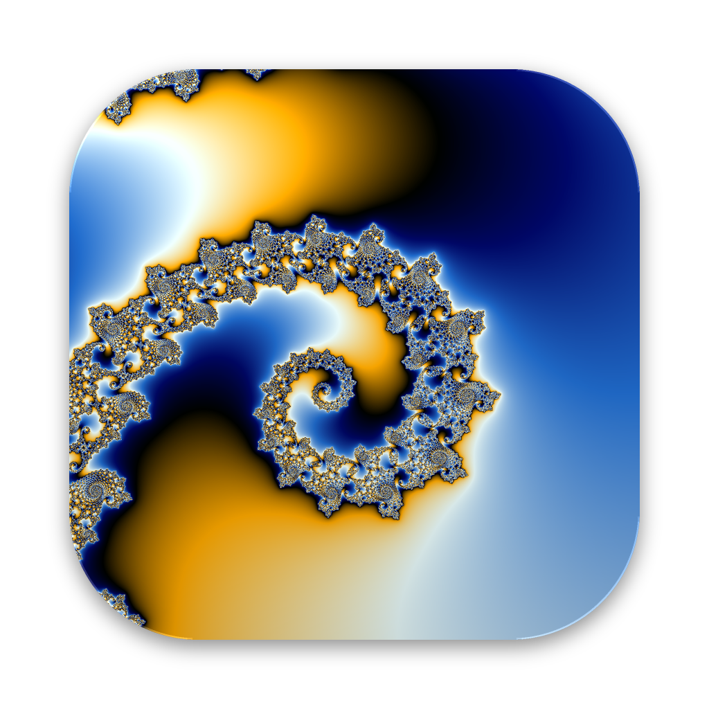

# Fractales: explore fractals on a Mac, fast and deep

<a id="english"></a>
**English** · [Version française plus bas ↓](#francais)

**⬇️ [Download the app here](https://github.com/Quick-Eyed-Sky/fractales/releases/latest)** (in the "Assets" section of the release)

**A small native Mac app, free and open source, for wandering through fractals.**
The computation runs on the graphics processor of Apple chips (M1, M2, M3, M4…) with Metal,
and zooms go down to ×10³⁰ without the picture breaking up into blurry pixels.

> Work in progress: the rendering engine and the endless voyage are here; 4K export and the
> colour editor come next.

## What it does

- **Endless voyage**: press **Start the Voyage** (or the V key) and just watch. The app zooms in
  continuously and steers by itself towards the richest detail, following the edges of the set,
  avoiding both the void and the grain where no shape ever comes out. If everything in view
  turns dull it backs out to look elsewhere; at the deepest zoom it climbs back up and dives
  again somewhere else. Touch the picture to take back control.
- **Five formulas**: Mandelbrot, Burning Ship, Tricorn, Multibrot z³, Celtic, and for each one
  **the Julia set** of any point (⌥-click on the picture, or the J key).
- **Ready-made figures**, each with its preview in the list on the left (in the current
  colours): Seahorse Valley, Douady's rabbit, the Burning Ship armada…
- **Smooth navigation**: drag or two fingers to move, pinch or scroll wheel to zoom under the
  pointer, **Space** to zoom towards the pointer (tap: ×3; hold: keeps going), ⇧ Space or
  right-click to zoom out. While moving, the picture is computed at half
  resolution to keep up, then recomputed at full resolution as soon as it stops.
- **Deep zooms** down to ×10³⁰ (see [How it works](#how-it-works)).
- **Six palettes**, shown as colour strips, with adjustable density and offset; changing the colours does not restart
  the computation.

## In English and French

The app speaks French on a Mac set to French, and English on a Mac set to English (or to any
other language). To see it in the other language without changing your Mac's: System Settings ›
General › Language & Region › Applications, + button, choose Fractales and the language.
Or, from the Terminal:

```
open Fractales.app --args -AppleLanguages '(fr)'
```

The English texts are in `source/en.lproj/Localizable.strings`; the French texts are written
directly in the code. `tests/check_strings.py` checks that no text was left untranslated.

## Download

[Latest release](https://github.com/Quick-Eyed-Sky/fractales/releases/latest): download `Fractales-….zip` under **Assets** and unzip it. Mac with an
Apple chip (M1 or later), macOS 14 or later.

The app is free and not signed with a paid Apple developer account, so macOS blocks it the
first time: double-click it, then go to **System Settings › Privacy & Security** and click
**Open Anyway**. Only once. Step by step in `READ-ME.txt`, inside the zip.

## Building the app

You only need Apple's command line tools (not the full Xcode):

```
xcode-select --install
cd fractales/source
./build_app.sh
```

`Fractales.app` appears in the `fractales` folder. macOS 14 or later, Apple chip.

The icon is drawn from real fractal renders by `tools/make_icon.py` (Python with numpy and Pillow),
which writes three variants in `icon/` and the chosen one in `source/AppIcon.icns`.
To switch, for example to the whole Mandelbrot set: `python3 tools/make_icon.py galaxie`.

## How it works

The graphics processor only computes with 32-bit floating-point numbers, which run out of
digits beyond a zoom of ×100,000. So Fractales uses **perturbation**: a single point of the
picture (the reference) is computed on the main processor with as many digits as needed (up to
144 digits, `FractalCore.c`), and for each pixel the GPU only computes the tiny difference from
that reference, which fits in 32 bits at any zoom (`Shaders.metal`). When that difference
becomes badly conditioned, the pixel is "rebased" onto an orbit starting from 0 (Zhuoran's
method), which avoids the usual perturbation artefacts.

| File | Role |
|---|---|
| `source/FractalCore.c` | high-precision fixed-point numbers, reference orbits |
| `source/Voyage.c` | the endless voyage's pilot, and the previews of the figures |
| `source/Shaders.metal` | per-pixel computation (perturbation) and colouring, compiled at launch |
| `source/Renderer.swift` | Metal control: orbits, textures, half resolution while moving |
| `source/FractalModel.swift` | view state: formula, high-precision centre, zoom, palettes |
| `source/CanvasView.swift` | mouse, trackpad, keyboard |
| `source/Previews.swift` | list of figures with their previews |
| `source/FractalesApp.swift` | window and settings panel (SwiftUI) |

## Tests

`tests/run_tests.sh` runs the GPU kernel on the main processor and compares each picture with a
direct 113-bit computation, for the five formulas and Julia, from the whole view down to a zoom
of ×10²⁸. It also flies the endless voyage in simulation over every formula, and checks that it
never gets lost in the void or the black and that it turns round before the deepest zoom. It
runs on Linux (gcc + libquadmath), and on every push to GitHub along with building
the app on a Mac (GitHub Actions).

## Publishing a version

`.github/workflows/release.yml` builds the app on a Mac and puts `Fractales-<version>.zip` in a
draft release, with the version taken from `source/FractalModel.swift`. Run it from the Actions
tab (**Release › Run workflow**), check the draft under **Releases**, then click **Publish
release**. For the next version, raise `version` in `source/FractalModel.swift` first.

## Licence

MIT, see [LICENSE](LICENSE).

---

<a id="francais"></a>
# Fractales : explorer les fractales sur Mac, vite et profond

[↑ English version above](#english) · **Français**

**⬇️ [Téléchargez l'appli ici](https://github.com/Quick-Eyed-Sky/fractales/releases/latest)** (dans la section « Assets » de la release)

**Une petite appli Mac native, gratuite et libre, pour se promener dans les fractales.**
Le calcul tourne sur le processeur graphique des puces Apple (M1, M2, M3, M4…) avec Metal,
et les zooms descendent jusqu'à ×10³⁰ sans que l'image se dégrade en pixels flous.

> Version de travail : le moteur de rendu et le voyage infini sont là ; l'export 4K et
> l'éditeur de couleurs arrivent ensuite.

## Ce qu'elle fait

- **Voyage infini** : appuyez sur **Lancer le voyage** (ou la touche V) et regardez. L'appli
  zoome sans fin et se dirige toute seule vers les zones les plus riches en détails, en suivant
  les contours de l'ensemble, sans se perdre dans le vide ni dans le grain où aucune forme
  n'apparaît. Si tout devient terne, elle recule pour chercher ailleurs ; au zoom le plus profond,
  elle remonte et replonge ailleurs. Toucher l'image reprend la main.
- **Cinq formules** : Mandelbrot, Burning Ship, Tricorne, Multibrot z³, Celtique, et pour
  chacune **l'ensemble de Julia** de n'importe quel point (⌥-clic sur l'image, ou la touche J).
- **Des figures toutes prêtes**, chacune avec son aperçu dans la liste de gauche (aux couleurs
  choisies) : vallée des hippocampes, lapin de Douady, l'armada du Burning Ship…
- **Navigation fluide** : glisser ou deux doigts pour se déplacer, pincer ou molette pour
  zoomer sous le pointeur, **Espace** pour zoomer vers le pointeur (une pression : ×3 ; en la
  tenant : on continue), ⇧ Espace ou clic droit pour reculer. Pendant le mouvement l'image est
  calculée en demi-résolution pour suivre, puis recalculée en pleine résolution dès l'arrêt.
- **Zooms profonds** jusqu'à ×10³⁰ (voir [Comment ça marche](#comment-ça-marche)).
- **Six palettes**, présentées en bandes de couleurs, avec densité et décalage réglables ; changer les couleurs ne relance pas le
  calcul.

## En français et en anglais

L'appli parle français sur un Mac réglé en français et anglais sur un Mac réglé en anglais (ou
dans toute autre langue). Pour la voir dans l'autre langue sans changer celle du Mac : Réglages
Système › Général › Langue et région › Applications, bouton +, choisir Fractales et la langue.
Ou, depuis le Terminal :

```
open Fractales.app --args -AppleLanguages '(en)'
```

Les textes anglais sont dans `source/en.lproj/Localizable.strings` ; les textes français sont
directement dans le code. `tests/check_strings.py` vérifie qu'aucun texte n'a été oublié.

## Télécharger

[Dernière version](https://github.com/Quick-Eyed-Sky/fractales/releases/latest) : téléchargez `Fractales-….zip` sous **Assets** et décompressez-le.
Mac à puce Apple (M1 ou plus récent), macOS 14 ou plus récent.

L'appli est gratuite et n'est pas signée par un compte développeur Apple payant : macOS la
bloque la première fois. Double-cliquez dessus, puis allez dans **Réglages Système ›
Confidentialité et sécurité** et cliquez sur **Ouvrir quand même**. Une seule fois suffit.
Pas à pas dans `LISEZ-MOI.txt`, dans le zip.

## Construire l'appli

Il faut seulement les outils en ligne de commande d'Apple (pas Xcode complet) :

```
xcode-select --install
cd fractales/source
./build_app.sh
```

`Fractales.app` apparaît dans le dossier `fractales`. macOS 14 ou plus récent, puce Apple.

L'icône est dessinée à partir de vrais rendus de fractales par `tools/make_icon.py` (Python avec numpy et Pillow),
qui écrit trois variantes dans `icon/` et celle choisie dans `source/AppIcon.icns`.
Pour en changer, par exemple pour l'ensemble de Mandelbrot entier : `python3 tools/make_icon.py galaxie`.

## Comment ça marche

Le processeur graphique ne calcule qu'en nombres à virgule de 32 bits, qui n'ont plus assez de
chiffres au-delà d'un zoom de ×100 000. Fractales utilise donc la **perturbation** : un seul
point de l'image (la référence) est calculé sur le processeur central avec autant de chiffres
que nécessaire (jusqu'à 144 chiffres, `FractalCore.c`), et le GPU ne calcule pour chaque pixel
que la minuscule différence avec cette référence, ce qui tient dans 32 bits à n'importe quel
zoom (`Shaders.metal`). Quand cette différence devient mal conditionnée, le pixel « rebascule »
sur une orbite qui part de 0 (méthode de Zhuoran), ce qui évite les artefacts classiques de la
perturbation.

| Fichier | Rôle |
|---|---|
| `source/FractalCore.c` | nombres en virgule fixe haute précision, orbites de référence |
| `source/Voyage.c` | le pilote du voyage infini, et les aperçus des figures |
| `source/Shaders.metal` | calcul par pixel (perturbation) et mise en couleurs, compilé au lancement |
| `source/Renderer.swift` | pilotage Metal : orbites, textures, demi-résolution pendant le mouvement |
| `source/FractalModel.swift` | état de la vue : formule, centre en haute précision, zoom, palettes |
| `source/CanvasView.swift` | souris, trackpad, clavier |
| `source/Previews.swift` | liste des figures avec leurs aperçus |
| `source/FractalesApp.swift` | fenêtre et panneau de réglages (SwiftUI) |

## Tests

`tests/run_tests.sh` exécute le noyau GPU sur le processeur central et compare chaque image à
un calcul direct en 113 bits, pour les cinq formules et Julia, de la vue d'ensemble jusqu'à un
zoom de ×10²⁸. Il fait aussi voler le voyage infini en simulation sur chaque formule, et vérifie
qu'il ne se perd jamais dans le vide ni dans le noir et qu'il fait demi-tour avant le zoom le
plus profond. Il tourne sous Linux (gcc + libquadmath), et à chaque envoi sur GitHub avec la
construction de l'appli sur un Mac (GitHub Actions).

## Publier une version

`.github/workflows/release.yml` construit l'appli sur un Mac et dépose `Fractales-<version>.zip`
dans une release en brouillon, avec le numéro de version pris dans `source/FractalModel.swift`.
Lancez-le depuis l'onglet Actions (**Release › Run workflow**), vérifiez le brouillon dans
**Releases**, puis cliquez sur **Publish release**. Pour la version suivante, augmentez d'abord
`version` dans `source/FractalModel.swift`.

## Licence

MIT, voir [LICENSE](LICENSE).
